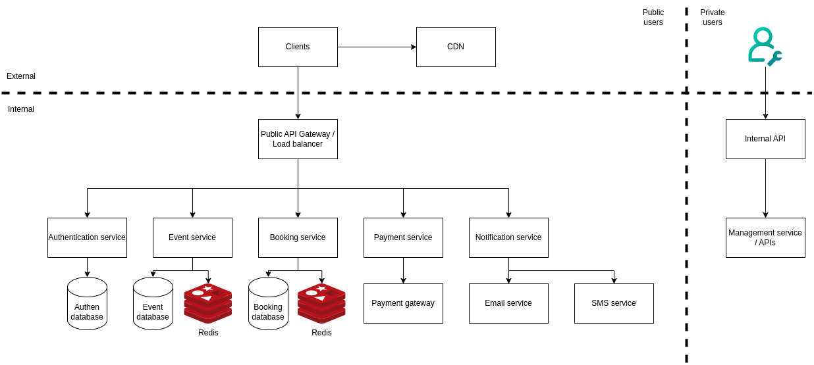

# Building a global event booking service
In this repo, I will discuss about how to build a global event booking service. Some of the requirements are:
- Allow users to search and book events worldwide, ensuring a smooth booking experience even under high traffic
- Platform should be able to handle a large number of users, especially during peak hours close to event dates
- Booking process should integrate with a payment gateway (e.g., Stripe) to handle ticket purchases securely
- Upon successful booking, the system should send confirmation and reminder notifications to the users before the event takes place

## Understand the problem
Assume that the system can host 10000 events, each event can have 50000 tickets available, the tickets for each event are sold in one month before the event takes place. Lets say hot event will have 10000 tickets sold in the first 10 minutes.
- User can book tickets from mobile or web app
- User can cancel the reservation

## Non-functional requirements
- High concurrency: During the first 10 minutes for the hot event, the system will have max 2000 requests per second at peak
- Fault tolerance: The system should be able to handle failures gracefully
- Scalability: The system should be able to scale horizontally to handle more traffic
- Moderate latency: The system should be able to handle the requests within a few seconds

## Back of the envelope calculation
- Assume that the hot event will have 50% (25000 tickets) of the total tickets sold in the first 10 minutes. This means that the system will have 2500 successful transactions per minute at peak or 42 successful transactions per second (TPS)
- Assume that the request rate will be higher due to get requests and other requests and drop to around 2000 requests per second at peak.

### Traffic Estimates
- Peak traffic: 2,000 requests per second (RPS)
- Successful transactions at peak: 42 TPS (2,500 per minute)
- Average traffic: 100 RPS (5% of peak)

### Daily Active Users (DAU)
- Requests per day: 100 RPS * 60 * 60 * 24 = 8.64 million requests/day
- Assuming 30 requests per user session
- DAU ≈ 288,000 users (rounded to 300,000)

### Storage Estimates
1. Ticket Storage:
   - Total events: 10,000
   - Tickets per event: 50,000
   - Total tickets: 10,000 * 50,000 = 500 million
   - Size per ticket: 1 KB
   - Total ticket storage: 500 million * 1 KB = 500 GB

2. Event Storage:
   - Events: 10,000
   - Size per event: 2 KB (including event details, images references, etc.)
   - Total event storage: 10,000 * 2 KB = 20 MB

3. User Storage:
   - Users: 300,000 DAU * 10 (assuming total users is 10x DAU)
   - Size per user: 2 KB (including profile, preferences, history)
   - Total user storage: 3 million * 2 KB = 6 GB

Total Base Storage: ~506 GB
With indexes, redundancy (1.5x): ~760 GB

### Bandwidth Estimates
For a request:
- Incoming data: 2,000 * 1.5 KB = 3 MB/s
- Outgoing data: 2,000 * 3 KB = 6 MB/s
Peak bandwidth: 9 MB/s or 72 Mbps

### Memory/Cache Estimates
1. Active Event Cache:
   - Hot events (5%): 500 events * 2 KB = 1 MB
   - Their tickets status: 500 * 50,000 * 100 bytes = 2.5 GB

2. User Session Cache:
   - Active sessions: 30,000 (10% of DAU)
   - Session size: 2 KB
   - Total session cache: 60 MB

3. Application Cache:
   - Code, static content, etc.: 500 MB

Total Cache Needed: ~3.1 GB

### Database IOPS
1. Writes:
   - Peak successful transactions: 42 TPS
   - Each transaction affects multiple records (ticket, user, event)
   - Estimated write IOPS: 42 * 3 = 126 IOPS

2. Reads:
   - Peak read requests: ~1,900 RPS (2,000 - 42 writes)
   - Assuming 80% cache hit rate
   - Database read IOPS: 380 IOPS

Total Peak IOPS: ~506 IOPS

### Compute Requirements
- Each request: 10 ms processing time
- CPU time needed: 2,000 * 10 ms = 20 seconds per second
- Minimum CPU cores: 20 (assuming 100% utilization)
- Recommended CPU cores: 40 (for 50% target utilization)

### Summary
- Storage: 760 GB (with redundancy)
- Peak Bandwidth: 72 Mbps
- Memory/Cache: 3.1 GB
- Database IOPS: 506 IOPS at peak
- CPU Cores: 40 recommended

### Infrastructure Recommendations
1. Application Servers:
   - 5-6 servers with 8 cores each
   - 16 GB RAM each
   - Allows for redundancy and handling peak load

2. Database:
   - Primary: 1 TB storage, 32 GB RAM
   - Read replicas: 2-3 instances
   - Consider sharding for future growth

3. Cache Layer:
   - Redis cluster with 4 GB capacity
   - At least 2 nodes for redundancy

4. Load Balancer:
   - 2 instances for redundancy
   - Capable of handling 100 Mbps traffic

## Architecture - High level design
### Architecture

- Public users: a user can search and book event tickets
- Admin or private users: can manage events, users, and platform configurations
- CDN or content delivery network: serve static content to users, reduce load on application servers by caching static content
- Public API Gateway / Load balancer: fully managed service that support routing, authentication, rate limiting, etc
- Internal API: APIs that only available for authorized or admin users. They can only be accessed through private network or VPN
- We will use the microservice architecture for the booking system. Each service will be responsible for a specific feature or functionality.
    - Authentication/authorization service: manage user accounts, roles, and permissions
    - Event service: manage events and detailed information for each event
    - Booking service: manage booking, cancellation, and other booking related operations
    - Payment service: integrate with payment gateway to handle payment processing
    - Notification service: send notifications to users before the event takes place, notification can be sent via email or SMS
    - Management service: manage the platform, users, and events. When admin makes changes via management console, these changes will be pushed to the actual service that owns the data. For example, when admin changes the event information, the change will be pushed to the event service.

### API Design Sample
This repo will focus on the API design for the booking service.
#### Event related APIs

| Method | Endpoint | Description | Request Body | Response |
|--------|----------|-------------|--------------|-----------|
| GET | `/api/events` | Get list of events | - | `{ "events": [...] }` |
| GET | `/api/events/{id}` | Get event details | - | `{ "event": {...} }` |
| POST | `/api/events` | Create new event | `{ "name": string, "date": date, "capacity": int }` | `{ "event": {...} }` |
| PUT | `/api/events/{id}` | Update event | `{ "name": string, "date": date, "capacity": int }` | `{ "event": {...} }` |
| DELETE | `/api/events/{id}` | Delete event | - | `{ "message": "success" }` |

#### Booking related APIs

| Method | Endpoint | Description | Request Body | Response |
|--------|----------|-------------|--------------|-----------|
| POST | `/api/bookings` | Create booking | `{ "event_id": int, "user_id": int, "tickets": int }` | `{ "booking": {...} }` |
| GET | `/api/bookings/{id}` | Get booking details | - | `{ "booking": {...} }` |
| GET | `/api/bookings/user/{user_id}` | Get user's bookings | - | `{ "bookings": [...] }` |
| PUT | `/api/bookings/{id}/cancel` | Cancel booking | - | `{ "message": "success" }` |
| GET | `/api/events/{id}/availability` | Check ticket availability | - | `{ "available": int }` |

### Data model (Sample for this repo)
This system will be read-heavy and write less frequently. This is because the number of users who visit the event page is much higher than the number of users actually booking tickets. Then relational database is a good choice for this system. NoSQL database are generally optimized for write-heavy systems.
A relational database provides ACID that guarantees ACID properties, without ACID, it's not easy to prevent problems such as negative balance, double charge, double reservation, etc. 
Schema of the database:

## Concurrency issues when booking tickets
